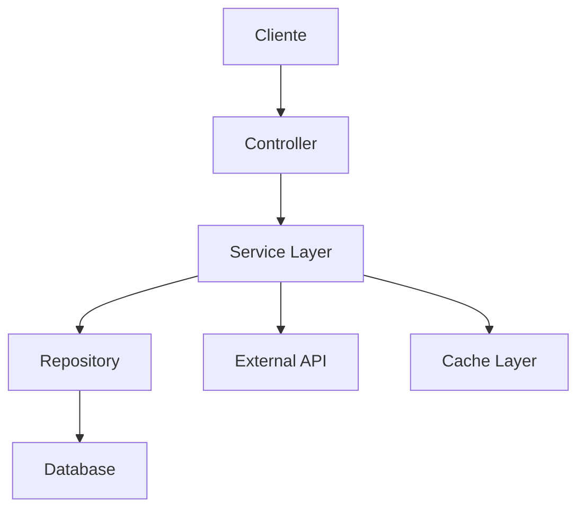
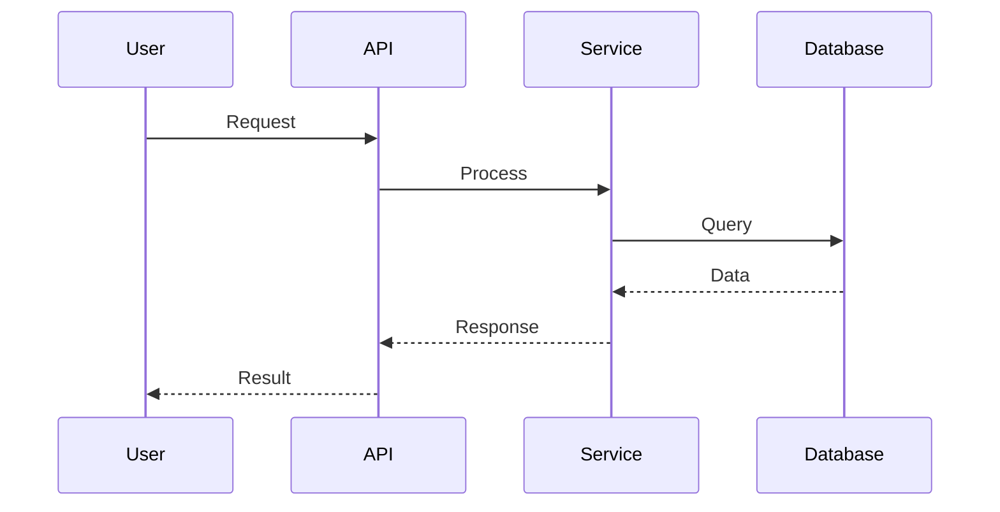
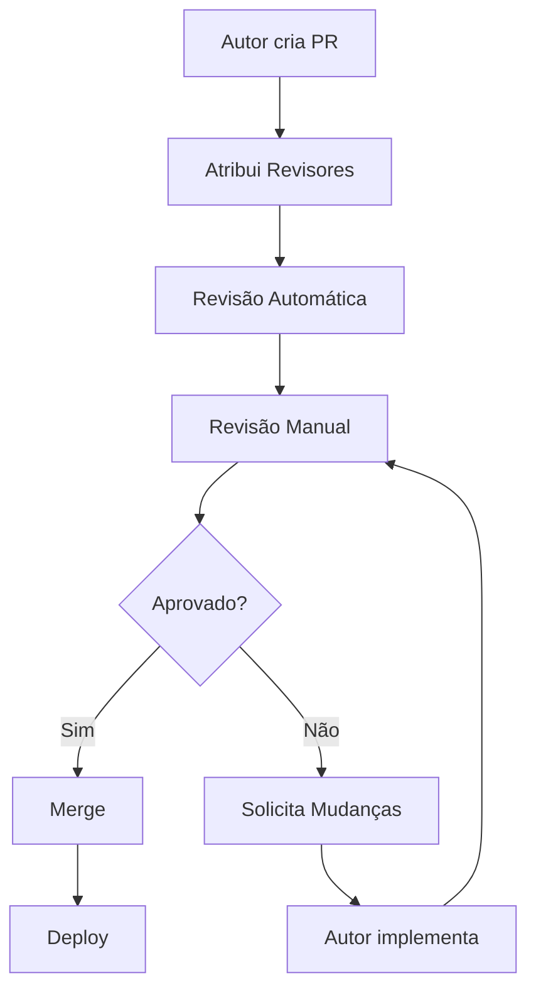

# Template de Code Review - [Nome do Projeto]

<div align="center">

**PR**: [#XXX] | **Autor**: [Nome do Autor] | **Data**: [DD/MM/AAAA]

[](link-pr)
[](link-sonar)
[](link-coverage)

[🔗 Pull Request](link-pr) • [📊 SonarQube](link-sonar) • [🧪 Pipeline](link-pipeline)

</div>

---

## 📋 Índice

- [Informações do PR](#-informações-do-pr)
- [Checklist de Revisão](#-checklist-de-revisão)
- [Análise Técnica](#-análise-técnica)
- [Comentários Detalhados](#-comentários-detalhados)
- [Métricas de Qualidade](#-métricas-de-qualidade)
- [Decisão Final](#-decisão-final)
- [Processo de Code Review](#-processo-de-code-review)

---

## 📊 Informações do PR

### Metadados

| Campo | Valor |
|-------|-------|
| **PR Number** | [#XXX] |
| **Título** | [Título do Pull Request] |
| **Autor** | [Nome do Autor] - [@username](link-profile) |
| **Revisor(es)** | [Nome do Revisor 1], [Nome do Revisor 2] |
| **Data de Criação** | [DD/MM/AAAA] |
| **Data de Revisão** | [DD/MM/AAAA] |
| **Branch** | `[feature/branch-name]` → `[main/develop]` |

### Contexto da Mudança

| Critério | Descrição |
|----------|-----------|
| **🎯 Objetivo** | [Descrição clara do objetivo do PR] |
| **📋 Ticket/Issue** | [#JIRA-XXX] - [Link para ticket] |
| **🔄 Tipo de Mudança** | [Feature/Bugfix/Refactor/Hotfix/Docs] |
| **📈 Impacto** | [Alto/Médio/Baixo] - [Justificativa] |
| **💥 Breaking Changes** | [Sim/Não] - [Descrição se aplicável] |
| **🎯 Área Afetada** | [Frontend/Backend/Database/Infrastructure] |

### Estatísticas do PR

| Métrica | Valor |
|---------|-------|
| **📁 Arquivos Alterados** | [X] arquivos |
| **➕ Linhas Adicionadas** | [+XXX] linhas |
| **➖ Linhas Removidas** | [-XXX] linhas |
| **📊 Complexidade** | [Baixa/Média/Alta] |
| **⏱️ Tempo Estimado de Revisão** | [XX] minutos |

---

## ✅ Checklist de Revisão

### 🎯 Funcionalidade

- [ ] **Requisitos Atendidos**: Implementa todos os requisitos do ticket
- [ ] **Funciona Corretamente**: Testado em cenários principais
- [ ] **Edge Cases**: Trata casos extremos adequadamente
- [ ] **Error Handling**: Tratamento de erros robusto
- [ ] **Backward Compatibility**: Mantém compatibilidade quando necessário

### 🏗️ Arquitetura e Design

- [ ] **Padrões de Projeto**: Segue padrões estabelecidos (SOLID, DRY, KISS)
- [ ] **Separação de Responsabilidades**: Cada módulo tem responsabilidade única
- [ ] **Acoplamento**: Baixo acoplamento entre componentes
- [ ] **Coesão**: Alta coesão dentro dos módulos
- [ ] **Extensibilidade**: Código facilmente extensível

### 💻 Qualidade do Código

- [ ] **Clean Code**: Código limpo e legível
- [ ] **Nomenclatura**: Nomes descritivos e consistentes
- [ ] **Complexidade**: Funções com complexidade adequada (< 10)
- [ ] **Duplicação**: Sem duplicação desnecessária de código
- [ ] **Comentários**: Comentários úteis e atualizados
- [ ] **Code Style**: Segue padrões de codificação do projeto

### 🧪 Testes

- [ ] **Testes Unitários**: Adicionados/atualizados conforme necessário
- [ ] **Cobertura**: Cobertura ≥ 85% para código novo
- [ ] **Testes de Integração**: Implementados quando aplicável
- [ ] **Testes E2E**: Atualizados para fluxos críticos
- [ ] **Mocks**: Uso adequado de mocks e stubs
- [ ] **Assertions**: Assertions claras e específicas

### 🔒 Segurança

- [ ] **Validação de Entrada**: Inputs validados e sanitizados
- [ ] **Autenticação**: Controles de autenticação adequados
- [ ] **Autorização**: Verificação de permissões implementada
- [ ] **Dados Sensíveis**: Tratamento seguro de informações sensíveis
- [ ] **OWASP Top 10**: Sem vulnerabilidades conhecidas
- [ ] **Secrets**: Nenhum secret hardcoded no código

### ⚡ Performance

- [ ] **Consultas Otimizadas**: Queries de banco eficientes
- [ ] **Cache**: Uso adequado de cache quando necessário
- [ ] **Algoritmos**: Algoritmos eficientes implementados
- [ ] **Memory Leaks**: Sem vazamentos de memória
- [ ] **N+1 Queries**: Evitadas consultas N+1
- [ ] **Lazy Loading**: Implementado quando apropriado

### 📚 Documentação

- [ ] **Docstrings**: Funções públicas documentadas (Google Style)
- [ ] **README**: Atualizado se necessário
- [ ] **CHANGELOG**: Entrada adicionada
- [ ] **API Docs**: Documentação de API atualizada
- [ ] **Comentários Inline**: Código complexo comentado
- [ ] **Migration Guide**: Guia de migração se breaking changes

### 🔧 DevOps e Infraestrutura

- [ ] **CI/CD**: Pipeline passa sem erros
- [ ] **Linting**: Sem violações de linting
- [ ] **Type Checking**: Verificação de tipos passa
- [ ] **Security Scan**: Scan de segurança limpo
- [ ] **Dependencies**: Dependências atualizadas e seguras
- [ ] **Environment**: Configurações de ambiente adequadas

---

## 🔍 Análise Técnica

### Arquitetura da Solução



**Descrição**: [Breve descrição da arquitetura implementada]

### Principais Mudanças

#### [Nome do Módulo/Componente 1]
- **Arquivo**: `[caminho/para/arquivo.py]`
- **Mudança**: [Descrição da mudança]
- **Justificativa**: [Por que foi necessário]
- **Impacto**: [Impacto da mudança]

#### [Nome do Módulo/Componente 2]
- **Arquivo**: `[caminho/para/arquivo.js]`
- **Mudança**: [Descrição da mudança]
- **Justificativa**: [Por que foi necessário]
- **Impacto**: [Impacto da mudança]

### Fluxo de Dados



---

## 💬 Comentários Detalhados

### 🔴 Críticos (Devem ser resolvidos)

#### CRIT-001: [Título do Problema]
**Arquivo**: `[caminho/para/arquivo.py]`  
**Linha**: [XXX]  
**Categoria**: [Segurança/Performance/Funcionalidade]

**Problema**:
```python
# Código problemático
def vulnerable_function(user_input):
    query = f"SELECT * FROM users WHERE name = '{user_input}'"  # SQL Injection
    return execute_query(query)
```

**Solução Sugerida**:
```python
# Código corrigido
def secure_function(user_input):
    query = "SELECT * FROM users WHERE name = %s"
    return execute_query(query, (user_input,))
```

**Justificativa**: [Explicação do problema e por que deve ser corrigido]

### 🟡 Melhorias (Sugestões)

#### SUGG-001: [Título da Sugestão]
**Arquivo**: `[caminho/para/arquivo.js]`  
**Linha**: [XXX]  
**Categoria**: [Code Quality/Performance/Maintainability]

**Sugestão**:
[Descrição da melhoria sugerida]

**Benefício**: [Benefício da implementação]

### 🟢 Informativos (Observações)

#### INFO-001: [Título da Observação]
**Arquivo**: `[caminho/para/arquivo.py]`  
**Linha**: [XXX]

**Observação**: [Comentário informativo ou elogio]

---

## 📊 Métricas de Qualidade

### Análise Estática

| Ferramenta | Score | Status | Detalhes |
|------------|-------|--------|----------|
| **SonarQube** | A | ✅ | 0 bugs, 2 code smells |
| **ESLint** | ✅ | ✅ | 0 erros, 3 warnings |
| **Flake8** | ✅ | ✅ | 0 violações |
| **MyPy** | ✅ | ✅ | Type checking passou |
| **Bandit** | ✅ | ✅ | Nenhuma vulnerabilidade |

### Cobertura de Testes

| Tipo | Antes | Depois | Delta | Status |
|------|-------|--------|-------|--------|
| **Unitários** | 82% | 87% | +5% | ✅ |
| **Integração** | 65% | 70% | +5% | ✅ |
| **E2E** | 45% | 45% | 0% | ⚠️ |
| **Overall** | 75% | 80% | +5% | ✅ |

### Performance

| Métrica | Antes | Depois | Melhoria | Status |
|---------|-------|--------|----------|--------|
| **Response Time** | 250ms | 180ms | 28% | ✅ |
| **Memory Usage** | 120MB | 115MB | 4% | ✅ |
| **CPU Usage** | 15% | 12% | 20% | ✅ |
| **Database Queries** | 8 | 5 | 37% | ✅ |

---

## ✅ Decisão Final

### Status da Revisão

**🎯 Status**: [✅ Aprovado | ⚠️ Aprovado com Condições | ❌ Rejeitado | 🔄 Requer Mudanças]

### Resumo da Avaliação

#### 🌟 Pontos Fortes
- [Ponto forte 1]
- [Ponto forte 2]
- [Ponto forte 3]

#### 🔧 Áreas de Melhoria
- [Área de melhoria 1]
- [Área de melhoria 2]

#### ⚠️ Ações Obrigatórias (se aplicável)
- [ ] [Ação obrigatória 1]
- [ ] [Ação obrigatória 2]

#### 💡 Sugestões para Futuro
- [Sugestão 1]
- [Sugestão 2]

### Aprovação

**Revisor**: [Nome do Revisor]  
**Data**: [DD/MM/AAAA]  
**Assinatura**: [Iniciais/Nome]

**Comentários Finais**:
[Comentários adicionais do revisor]

---

## 🔄 Processo de Code Review

### Fluxo de Revisão



### Critérios de Atribuição

| Tipo de PR | Revisores | Critério |
|------------|-----------|----------|
| **Hotfix** | 1 Senior | Urgência alta |
| **Feature** | 2 (1 Senior + 1 Pleno) | Complexidade média/alta |
| **Bugfix** | 1 Pleno/Senior | Impacto do bug |
| **Refactor** | 1 Senior | Conhecimento arquitetural |
| **Docs** | 1 Qualquer | Revisão de conteúdo |

### Tempos de Resposta

| Prioridade | Tempo Máximo | Descrição |
|------------|--------------|-----------|
| **🔴 Crítico** | 2 horas | Hotfixes, vulnerabilidades |
| **🟠 Alto** | 24 horas | Features importantes |
| **🟡 Médio** | 48 horas | Features normais |
| **🟢 Baixo** | 72 horas | Refactors, docs |

### Boas Práticas

#### Para Autores
- **PRs Pequenos**: Máximo 400 linhas alteradas
- **Descrição Clara**: Contexto e objetivos bem definidos
- **Self-Review**: Revisar próprio código antes de submeter
- **Testes**: Incluir testes adequados
- **Documentação**: Atualizar documentação relevante

#### Para Revisores
- **Construtividade**: Feedback construtivo e respeitoso
- **Foco no Código**: Criticar código, não pessoa
- **Explicações**: Justificar sugestões e críticas
- **Balanceamento**: Reconhecer pontos positivos
- **Aprendizado**: Usar como oportunidade de ensino

### Ferramentas de Apoio

| Ferramenta | Propósito | Integração |
|------------|-----------|------------|
| **SonarQube** | Análise estática | Automática no PR |
| **CodeClimate** | Qualidade de código | GitHub integration |
| **Snyk** | Vulnerabilidades | Scan automático |
| **Codecov** | Cobertura de testes | Report no PR |
| **Lighthouse** | Performance web | CI/CD pipeline |

---

<div align="center">

**Mantido por**: Equipe de Desenvolvimento DATAMETRIA  
**Última Atualização**: [DD/MM/AAAA]  
**Versão do Template**: 1.0.0

---

**Para dúvidas sobre code review**: [email-dev] | **Processo completo**: [link-processo]

</div>