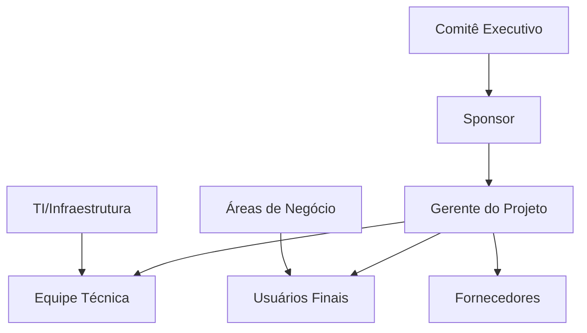
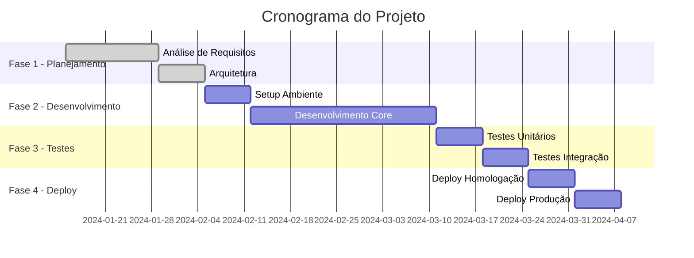

# Project Kickoff - [Nome do Projeto]

<div align="center">

**Data do Kickoff**: [DD/MM/AAAA] | **Duração**: [X] meses | **Orçamento**: [R$ XXX]

[](link-projeto)
[](link-team)
[](link-priority)

[📊 Dashboard](link-dashboard) • [📋 Charter](link-charter) • [👥 Equipe](link-team)

</div>

---

## 📋 Índice

- [Visão Geral do Projeto](#-visão-geral-do-projeto)
- [Objetivos e Escopo](#-objetivos-e-escopo)
- [Stakeholders](#-stakeholders)
- [Equipe do Projeto](#-equipe-do-projeto)
- [Cronograma e Marcos](#-cronograma-e-marcos)
- [Orçamento e Recursos](#-orçamento-e-recursos)
- [Riscos e Premissas](#-riscos-e-premissas)
- [Critérios de Sucesso](#-critérios-de-sucesso)
- [Comunicação](#-comunicação)
- [Próximos Passos](#-próximos-passos)

---

## 🎯 Visão Geral do Projeto

### Informações Básicas

| Campo | Valor |
|-------|-------|
| **Nome do Projeto** | [Nome do Projeto] |
| **Código/ID** | [PROJ-XXX] |
| **Sponsor** | [Nome do Sponsor] |
| **Gerente/Líder** | [Nome] - [email] |
| **Data de Início** | [DD/MM/AAAA] |
| **Data de Término** | [DD/MM/AAAA] |
| **Duração** | [X] meses |
| **Prioridade** | [Alta/Média/Baixa] |

### Contexto e Justificativa

**Problema/Oportunidade**:
[Descrição clara do problema que o projeto resolve ou oportunidade que explora]

**Justificativa de Negócio**:
[Por que este projeto é importante para a organização]

**Alinhamento Estratégico**:
[Como o projeto se alinha com os objetivos estratégicos da empresa]

---

## 🎯 Objetivos e Escopo

### Objetivos do Projeto

#### Objetivo Principal
[Objetivo principal do projeto - o que queremos alcançar]

#### Objetivos Específicos
- **[Objetivo 1]**: [Descrição detalhada]
- **[Objetivo 2]**: [Descrição detalhada]
- **[Objetivo 3]**: [Descrição detalhada]

### Escopo do Projeto

#### ✅ Dentro do Escopo
- [Item 1 que está incluído no projeto]
- [Item 2 que está incluído no projeto]
- [Item 3 que está incluído no projeto]

#### ❌ Fora do Escopo
- [Item 1 que NÃO está incluído no projeto]
- [Item 2 que NÃO está incluído no projeto]
- [Item 3 que NÃO está incluído no projeto]

### Entregas Principais

| Entrega | Descrição | Responsável | Data Prevista |
|---------|-----------|-------------|---------------|
| **[Entrega 1]** | [Descrição] | [Nome] | [DD/MM/AAAA] |
| **[Entrega 2]** | [Descrição] | [Nome] | [DD/MM/AAAA] |
| **[Entrega 3]** | [Descrição] | [Nome] | [DD/MM/AAAA] |

---

## 👥 Stakeholders

### Mapa de Stakeholders



### Stakeholders Principais

#### Internos

| Nome | Papel | Responsabilidade | Nível de Influência | Contato |
|------|-------|------------------|-------------------|---------|
| **[Nome]** | Sponsor | Aprovação e recursos | Alto | [email] |
| **[Nome]** | Product Owner | Definição de requisitos | Alto | [email] |
| **[Nome]** | Tech Lead | Arquitetura técnica | Médio | [email] |
| **[Nome]** | Usuário Chave | Validação e testes | Médio | [email] |

#### Externos

| Nome/Empresa | Papel | Responsabilidade | Contato |
|--------------|-------|------------------|---------|
| **[Nome/Empresa]** | Fornecedor | [Serviço/Produto] | [email] |
| **[Nome/Empresa]** | Consultor | [Especialidade] | [email] |

### Matriz RACI

| Atividade | Sponsor | PM | Tech Lead | Equipe | Usuários |
|-----------|---------|----|-----------|------------|----------|
| **Aprovação de Escopo** | A | R | C | I | C |
| **Definição Técnica** | I | A | R | C | I |
| **Desenvolvimento** | I | A | R | R | I |
| **Testes de Aceitação** | I | A | C | C | R |

**Legenda**: R=Responsável, A=Aprovador, C=Consultado, I=Informado

---

## 👨‍💻 Equipe do Projeto

### Organograma da Equipe

```mermaid
graph TD
    A[Sponsor<br/>[Nome]] --> B[Gerente do Projeto<br/>[Nome]]
    B --> C[Tech Lead<br/>[Nome]]
    B --> D[Product Owner<br/>[Nome]]
    
    C --> E[Dev Frontend<br/>[Nome]]
    C --> F[Dev Backend<br/>[Nome]]
    C --> G[DevOps<br/>[Nome]]
    
    D --> H[UX/UI Designer<br/>[Nome]]
    D --> I[Business Analyst<br/>[Nome]]
```

### Composição da Equipe

| Papel | Nome | Dedicação | Período | Responsabilidades |
|-------|------|-----------|---------|-------------------|
| **Sponsor** | [Nome] | 10% | Todo projeto | Aprovações e recursos |
| **Gerente do Projeto** | [Nome] | 100% | Todo projeto | Coordenação geral |
| **Tech Lead** | [Nome] | 80% | Todo projeto | Arquitetura e liderança técnica |
| **Product Owner** | [Nome] | 60% | Todo projeto | Requisitos e priorização |
| **Desenvolvedor Frontend** | [Nome] | 100% | Fases 2-4 | Desenvolvimento frontend |
| **Desenvolvedor Backend** | [Nome] | 100% | Fases 2-4 | Desenvolvimento backend |
| **DevOps** | [Nome] | 40% | Fases 3-5 | Infraestrutura e deploy |
| **UX/UI Designer** | [Nome] | 80% | Fases 1-3 | Design e experiência |

### Papéis e Responsabilidades

#### Gerente do Projeto
- Coordenação geral do projeto
- Gestão de cronograma e recursos
- Comunicação com stakeholders
- Gestão de riscos e issues

#### Tech Lead
- Definição da arquitetura técnica
- Liderança da equipe de desenvolvimento
- Code review e qualidade técnica
- Decisões técnicas estratégicas

#### Product Owner
- Definição e priorização de requisitos
- Validação de entregas
- Interface com usuários finais
- Critérios de aceitação

---

## 📅 Cronograma e Marcos

### Fases do Projeto



### Marcos Principais

| Marco | Descrição | Data | Critério de Aceitação |
|-------|-----------|------|----------------------|
| **M1** | Aprovação da Arquitetura | [DD/MM/AAAA] | Documento aprovado pelo Tech Lead |
| **M2** | MVP Funcional | [DD/MM/AAAA] | Funcionalidades core implementadas |
| **M3** | Testes Concluídos | [DD/MM/AAAA] | 85% cobertura, 0 bugs críticos |
| **M4** | Go-Live | [DD/MM/AAAA] | Sistema em produção e operacional |

### Cronograma Detalhado

#### Fase 1: Planejamento (Semanas 1-3)
- **Semana 1**: Kickoff e análise de requisitos
- **Semana 2**: Definição de arquitetura
- **Semana 3**: Planejamento detalhado

#### Fase 2: Desenvolvimento (Semanas 4-8)
- **Semana 4**: Setup de ambiente e infraestrutura
- **Semanas 5-7**: Desenvolvimento das funcionalidades core
- **Semana 8**: Integração e testes iniciais

#### Fase 3: Testes e Validação (Semanas 9-10)
- **Semana 9**: Testes unitários e integração
- **Semana 10**: Testes de aceitação com usuários

#### Fase 4: Deploy e Go-Live (Semanas 11-12)
- **Semana 11**: Deploy em homologação
- **Semana 12**: Deploy em produção e go-live

---

## 💰 Orçamento e Recursos

### Orçamento Aprovado

| Categoria | Valor Aprovado | % do Total |
|-----------|----------------|------------|
| **Recursos Humanos** | R$ [XXX] | [XX%] |
| **Infraestrutura** | R$ [XXX] | [XX%] |
| **Software/Licenças** | R$ [XXX] | [XX%] |
| **Serviços Externos** | R$ [XXX] | [XX%] |
| **Contingência (10%)** | R$ [XXX] | [XX%] |
| **TOTAL** | **R$ [XXX]** | **100%** |

### Recursos Necessários

#### Recursos Humanos
- [X] Desenvolvedores por [Y] meses
- [X] Designers por [Y] meses
- [X] DevOps por [Y] meses

#### Infraestrutura
- Servidores de desenvolvimento e homologação
- Ambiente de produção (cloud/on-premise)
- Ferramentas de monitoramento

#### Software e Licenças
- IDEs e ferramentas de desenvolvimento
- Licenças de software específico
- Ferramentas de gestão de projeto

---

## ⚠️ Riscos e Premissas

### Riscos Identificados

| ID | Risco | Probabilidade | Impacto | Mitigação | Responsável |
|----|-------|---------------|---------|-----------|-------------|
| **R001** | Atraso na definição de requisitos | Média | Alto | Workshops intensivos com stakeholders | Product Owner |
| **R002** | Indisponibilidade de recursos chave | Baixa | Alto | Backup de recursos e documentação | Gerente |
| **R003** | Mudanças de escopo | Alta | Médio | Processo formal de change request | Sponsor |
| **R004** | Problemas de integração | Média | Médio | Testes de integração antecipados | Tech Lead |

### Premissas

- [ ] Recursos da equipe estarão disponíveis conforme planejado
- [ ] Stakeholders estarão disponíveis para validações
- [ ] Infraestrutura será provisionada no prazo
- [ ] Não haverá mudanças significativas de escopo
- [ ] Orçamento aprovado será mantido

### Restrições

- **Prazo**: Projeto deve ser concluído até [DD/MM/AAAA]
- **Orçamento**: Limite máximo de R$ [XXX]
- **Recursos**: Equipe limitada a [X] pessoas
- **Tecnologia**: Deve usar stack tecnológico aprovado
- **Compliance**: Deve atender requisitos de segurança

---

## 🎯 Critérios de Sucesso

### Critérios Quantitativos

| Métrica | Meta | Como Medir |
|---------|------|------------|
| **Prazo** | Entrega até [DD/MM/AAAA] | Data de go-live |
| **Orçamento** | Dentro do orçamento aprovado | Controle financeiro |
| **Qualidade** | 0 bugs críticos em produção | Monitoramento pós go-live |
| **Performance** | Tempo de resposta < 2s | Testes de performance |
| **Cobertura de Testes** | ≥ 85% | Relatórios de cobertura |

### Critérios Qualitativos

- **Satisfação dos Usuários**: Feedback positivo dos usuários finais
- **Adoção**: [X]% dos usuários utilizando o sistema em 30 dias
- **Estabilidade**: Sistema operacional sem interrupções
- **Manutenibilidade**: Código bem documentado e estruturado
- **Escalabilidade**: Sistema suporta crescimento previsto

### Definição de Pronto (DoD)

#### Para Funcionalidades
- [ ] Código desenvolvido e revisado
- [ ] Testes unitários implementados
- [ ] Testes de integração passando
- [ ] Documentação atualizada
- [ ] Aprovação do Product Owner

#### Para o Projeto
- [ ] Todas as funcionalidades entregues
- [ ] Testes de aceitação aprovados
- [ ] Sistema em produção
- [ ] Documentação completa
- [ ] Treinamento dos usuários realizado
- [ ] Handover para equipe de suporte

---

## 📢 Comunicação

### Plano de Comunicação

| Audiência | Frequência | Formato | Responsável | Conteúdo |
|-----------|------------|---------|-------------|----------|
| **Sponsor** | Semanal | Email/Reunião | Gerente | Status geral, riscos, decisões |
| **Stakeholders** | Quinzenal | Apresentação | Gerente | Progresso, demos, próximos passos |
| **Equipe** | Diário | Daily Standup | Scrum Master | Progresso, impedimentos |
| **Usuários** | Mensal | Newsletter | Product Owner | Novidades, cronograma |

### Canais de Comunicação

- **📧 Email**: Comunicações formais e documentação
- **💬 Slack/Teams**: Comunicação diária da equipe
- **📹 Reuniões**: Status, decisões e alinhamentos
- **📊 Dashboard**: Métricas e progresso em tempo real
- **📋 Wiki**: Documentação e conhecimento

### Reuniões Regulares

#### Daily Standup
- **Frequência**: Diária
- **Duração**: 15 minutos
- **Participantes**: Equipe de desenvolvimento
- **Objetivo**: Sincronização e identificação de impedimentos

#### Weekly Status
- **Frequência**: Semanal
- **Duração**: 30 minutos
- **Participantes**: Gerente, Tech Lead, Product Owner
- **Objetivo**: Status geral e tomada de decisões

#### Sprint Review
- **Frequência**: A cada 2 semanas
- **Duração**: 1 hora
- **Participantes**: Equipe + Stakeholders
- **Objetivo**: Demo e feedback

---

## ➡️ Próximos Passos

### Ações Imediatas (Próximos 7 dias)

- [ ] **[Ação 1]**: [Descrição] - Responsável: [Nome] - Prazo: [DD/MM]
- [ ] **[Ação 2]**: [Descrição] - Responsável: [Nome] - Prazo: [DD/MM]
- [ ] **[Ação 3]**: [Descrição] - Responsável: [Nome] - Prazo: [DD/MM]

### Setup Inicial

#### Ferramentas e Ambiente
- [ ] Configurar repositório de código
- [ ] Setup de ambiente de desenvolvimento
- [ ] Configurar ferramentas de CI/CD
- [ ] Criar dashboards de monitoramento

#### Documentação
- [ ] Criar documentação técnica inicial
- [ ] Definir padrões de código
- [ ] Estabelecer processo de code review
- [ ] Documentar arquitetura

#### Equipe
- [ ] Onboarding dos membros da equipe
- [ ] Definir rituais ágeis
- [ ] Estabelecer canais de comunicação
- [ ] Treinamentos necessários

### Primeira Sprint (Semanas 1-2)

#### Objetivos
- Finalizar análise de requisitos
- Definir arquitetura técnica
- Setup completo do ambiente
- Primeiras funcionalidades básicas

#### Entregas Esperadas
- Documento de requisitos aprovado
- Arquitetura técnica definida
- Ambiente de desenvolvimento funcional
- Protótipo inicial

---

## 📋 Checklist de Kickoff

### Antes do Kickoff
- [ ] Sponsor e stakeholders confirmados
- [ ] Equipe definida e disponível
- [ ] Orçamento aprovado
- [ ] Cronograma inicial validado
- [ ] Riscos principais identificados

### Durante o Kickoff
- [ ] Apresentação da visão do projeto
- [ ] Alinhamento de objetivos e escopo
- [ ] Apresentação da equipe
- [ ] Discussão de riscos e premissas
- [ ] Definição de próximos passos

### Após o Kickoff
- [ ] Ata da reunião distribuída
- [ ] Ações definidas e atribuídas
- [ ] Ferramentas e acessos configurados
- [ ] Primeira sprint planejada
- [ ] Comunicação regular estabelecida

---

<div align="center">

**Preparado por**: [Nome do Gerente] - [Data]  
**Aprovado por**: [Nome do Sponsor] - [Data]  
**Próxima Revisão**: [DD/MM/AAAA]

---

**Para dúvidas sobre este projeto**: [email-contato]

</div>