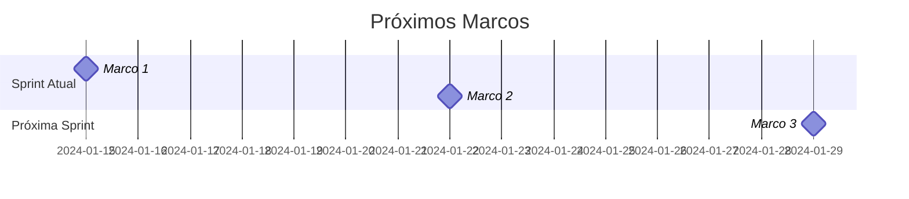
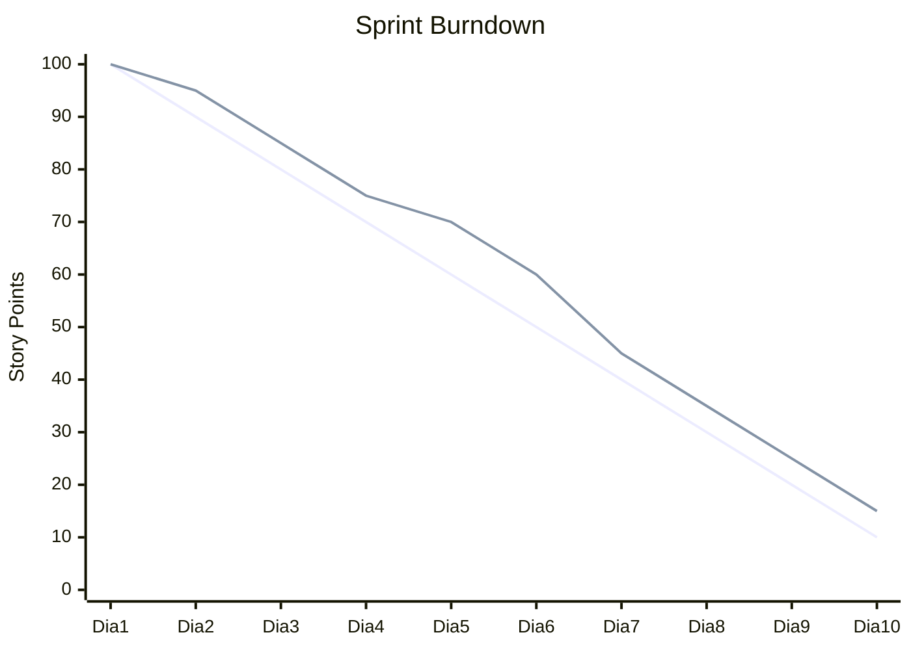

# Project Status Report - [Nome do Projeto]

**Período**: [DD/MM/AAAA] - [DD/MM/AAAA] | **Status**: [🟢 Verde/🟡 Amarelo/🔴 Vermelho] | **Data**: [DD/MM/AAAA]

[📊 Dashboard](link-dashboard) • [📋 Backlog](link-backlog) • [📈 Métricas](link-metrics)

---

## 📋 Índice

- [Resumo Executivo](#-resumo-executivo)
- [Principais Conquistas](#-principais-conquistas)
- [Próximos Passos](#-próximos-passos)
- [Riscos e Bloqueios](#-riscos-e-bloqueios)
- [Métricas do Projeto](#-métricas-do-projeto)
- [Recursos e Equipe](#-recursos-e-equipe)
- [Qualidade e Testes](#-qualidade-e-testes)
- [Comunicação](#-comunicação)

---

## 📊 Resumo Executivo

### Informações Gerais

| Campo | Valor |
|-------|-------|
| **Projeto** | [Nome do Projeto] |
| **Gerente/Líder** | [Nome] - [email] |
| **Período** | [DD/MM/AAAA] a [DD/MM/AAAA] |
| **Sprint/Iteração** | [Sprint X] |
| **Status Geral** | [🟢 Verde / 🟡 Amarelo / 🔴 Vermelho] |

### Status por Área

| Área | Status | Observações |
|------|--------|-------------|
| **📅 Cronograma** | [🟢/🟡/🔴] | [Observação] |
| **💰 Orçamento** | [🟢/🟡/🔴] | [Observação] |
| **👥 Recursos** | [🟢/🟡/🔴] | [Observação] |
| **🎯 Escopo** | [🟢/🟡/🔴] | [Observação] |
| **🔧 Qualidade** | [🟢/🟡/🔴] | [Observação] |

### Resumo do Período

[Descrição em 2-3 frases sobre o progresso geral, principais realizações e sentimento da equipe no período]

---

## 🎯 Principais Conquistas

### ✅ Entregas Concluídas

#### [Nome da Entrega 1]
- **Descrição**: [Descrição da entrega]
- **Data de Conclusão**: [DD/MM/AAAA]
- **Responsável**: [Nome]
- **Impacto**: [Alto/Médio/Baixo]

#### [Nome da Entrega 2]
- **Descrição**: [Descrição da entrega]
- **Data de Conclusão**: [DD/MM/AAAA]
- **Responsável**: [Nome]
- **Impacto**: [Alto/Médio/Baixo]

### 🏆 Marcos Alcançados

- ✅ **[Marco 1]**: [Descrição] - [Data]
- ✅ **[Marco 2]**: [Descrição] - [Data]
- ✅ **[Marco 3]**: [Descrição] - [Data]

### 📈 Melhorias Implementadas

- **Performance**: [Descrição da melhoria]
- **Qualidade**: [Descrição da melhoria]
- **Processo**: [Descrição da melhoria]

---

## ➡️ Próximos Passos

### Prioridades da Próxima Sprint/Período

#### 🔴 Críticas (Próximos 3-5 dias)
- [ ] **[Tarefa Crítica 1]**: [Descrição] - Responsável: [Nome]
- [ ] **[Tarefa Crítica 2]**: [Descrição] - Responsável: [Nome]

#### 🟠 Altas (Próxima semana)
- [ ] **[Tarefa Alta 1]**: [Descrição] - Responsável: [Nome]
- [ ] **[Tarefa Alta 2]**: [Descrição] - Responsável: [Nome]

#### 🟡 Médias (Próximas 2 semanas)
- [ ] **[Tarefa Média 1]**: [Descrição] - Responsável: [Nome]
- [ ] **[Tarefa Média 2]**: [Descrição] - Responsável: [Nome]

### Marcos Planejados

---

## ⚠️ Riscos e Bloqueios

### 🔴 Bloqueios Atuais

#### BLOCK-001: [Nome do Bloqueio]
- **Descrição**: [Descrição detalhada do bloqueio]
- **Impacto**: [Alto/Médio/Baixo]
- **Área Afetada**: [Frontend/Backend/DevOps/etc]
- **Desde**: [DD/MM/AAAA]
- **Responsável pela Resolução**: [Nome]
- **Ação**: [O que está sendo feito]
- **Prazo Estimado**: [DD/MM/AAAA]

### ⚠️ Riscos Identificados

| ID | Risco | Probabilidade | Impacto | Mitigação | Responsável |
|----|-------|---------------|---------|-----------|-------------|
| **RISK-001** | [Descrição do risco] | [Alta/Média/Baixa] | [Alto/Médio/Baixo] | [Ação de mitigação] | [Nome] |
| **RISK-002** | [Descrição do risco] | [Alta/Média/Baixa] | [Alto/Médio/Baixo] | [Ação de mitigação] | [Nome] |

### 🛠️ Ações de Mitigação

- **[Ação 1]**: [Descrição] - Prazo: [DD/MM/AAAA] - Responsável: [Nome]
- **[Ação 2]**: [Descrição] - Prazo: [DD/MM/AAAA] - Responsável: [Nome]

---

## 📊 Métricas do Projeto

### Progresso Geral

**Progresso do Projeto: [XX]%**

| Métrica | Planejado | Atual | Variação | Status |
|---------|-----------|-------|----------|--------|
| **Cronograma** | [100%] | [XX%] | [+/-X dias] | [🟢/🟡/🔴] |
| **Orçamento** | [R$ XXX] | [R$ XXX] | [+/-X%] | [🟢/🟡/🔴] |
| **Escopo** | [100%] | [XX%] | [+/-X%] | [🟢/🟡/🔴] |

### Métricas de Desenvolvimento

#### Sprint Atual
- **Tarefas Planejadas**: [X]
- **Tarefas Concluídas**: [X]
- **Taxa de Conclusão**: [XX%]
- **Velocity**: [X] pontos

#### Qualidade
- **Cobertura de Testes**: [XX%]
- **Bugs Abertos**: [X]
- **Bugs Resolvidos**: [X]
- **Code Review**: [XX%] aprovados

#### Performance
- **Build Time**: [X] minutos
- **Deploy Time**: [X] minutos
- **Uptime**: [XX.X%]

### Burndown Chart

---

## 👥 Recursos e Equipe

### Composição da Equipe

| Papel | Nome | Disponibilidade | Status |
|-------|------|----------------|--------|
| **Product Owner** | [Nome] | [100%] | [Ativo] |
| **Scrum Master** | [Nome] | [100%] | [Ativo] |
| **Tech Lead** | [Nome] | [100%] | [Ativo] |
| **Desenvolvedor Frontend** | [Nome] | [80%] | [Ativo] |
| **Desenvolvedor Backend** | [Nome] | [100%] | [Ativo] |
| **DevOps** | [Nome] | [50%] | [Compartilhado] |
| **UX/UI Designer** | [Nome] | [60%] | [Ativo] |

### Mudanças na Equipe

- **Entradas**: [Nome] - [Papel] - [Data de início]
- **Saídas**: [Nome] - [Papel] - [Data de saída]
- **Mudanças de Papel**: [Descrição]

### Capacidade da Equipe

- **Horas Disponíveis**: [X] horas/semana
- **Horas Utilizadas**: [X] horas/semana
- **Utilização**: [XX%]

---

## 🧪 Qualidade e Testes

### Métricas de Qualidade

| Métrica | Meta | Atual | Status |
|---------|------|-------|--------|
| **Cobertura de Testes** | ≥85% | [XX%] | [🟢/🟡/🔴] |
| **Code Quality Score** | ≥A | [Score] | [🟢/🟡/🔴] |
| **Vulnerabilidades** | 0 | [X] | [🟢/🟡/🔴] |
| **Technical Debt** | <2h | [Xh] | [🟢/🟡/🔴] |

### Status dos Testes

#### Testes Automatizados
- **Unitários**: [X] testes - [XX%] passando
- **Integração**: [X] testes - [XX%] passando
- **E2E**: [X] testes - [XX%] passando

#### Bugs e Issues
- **Bugs Críticos**: [X] abertos
- **Bugs Altos**: [X] abertos
- **Bugs Médios**: [X] abertos
- **Bugs Baixos**: [X] abertos

---

## 📢 Comunicação

### Reuniões Realizadas

- **[DD/MM]**: [Tipo de reunião] - [Participantes] - [Principais decisões]
- **[DD/MM]**: [Tipo de reunião] - [Participantes] - [Principais decisões]

### Próximas Reuniões

- **[DD/MM]**: [Tipo de reunião] - [Horário] - [Participantes]
- **[DD/MM]**: [Tipo de reunião] - [Horário] - [Participantes]

### Comunicações Importantes

- **Stakeholders**: [Última comunicação em DD/MM/AAAA]
- **Sponsor**: [Última comunicação em DD/MM/AAAA]
- **Usuários**: [Última comunicação em DD/MM/AAAA]

### Feedback Recebido

- **Positivo**: [Resumo do feedback positivo]
- **Pontos de Melhoria**: [Resumo dos pontos de melhoria]
- **Ações Tomadas**: [Ações baseadas no feedback]

---

## 📋 Ações Requeridas

### Decisões Pendentes

- [ ] **[Decisão 1]**: [Descrição] - Responsável: [Nome] - Prazo: [DD/MM/AAAA]
- [ ] **[Decisão 2]**: [Descrição] - Responsável: [Nome] - Prazo: [DD/MM/AAAA]

### Aprovações Necessárias

- [ ] **[Aprovação 1]**: [Descrição] - Aprovador: [Nome] - Prazo: [DD/MM/AAAA]
- [ ] **[Aprovação 2]**: [Descrição] - Aprovador: [Nome] - Prazo: [DD/MM/AAAA]

### Suporte Necessário

- **[Área/Pessoa]**: [Tipo de suporte necessário]
- **[Área/Pessoa]**: [Tipo de suporte necessário]

---

## 📊 Anexos

### Links Importantes

- **📊 Dashboard do Projeto**: [Link]
- **📋 Backlog**: [Link]
- **📈 Métricas**: [Link]
- **📚 Documentação**: [Link]
- **🔧 Repositório**: [Link]

### Documentos de Referência

- **Project Charter**: [Link]
- **Cronograma Detalhado**: [Link]
- **Plano de Riscos**: [Link]
- **Plano de Comunicação**: [Link]

---

**Preparado por**: [Nome do Gerente/Líder] - [Data]  
**Revisado por**: [Nome] - [Data]  
**Próximo Relatório**: [DD/MM/AAAA]

---

**Para dúvidas sobre este relatório**: [email-contato]

