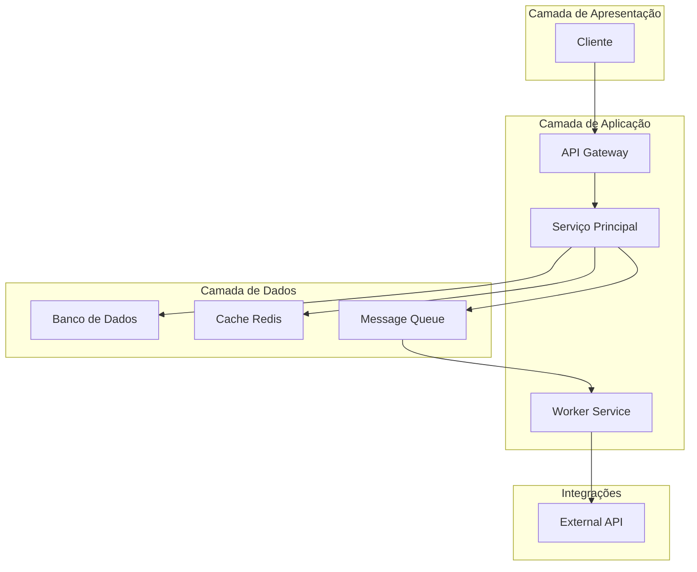
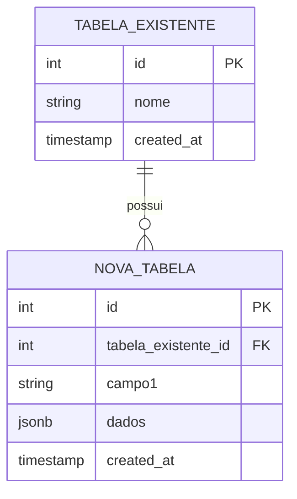
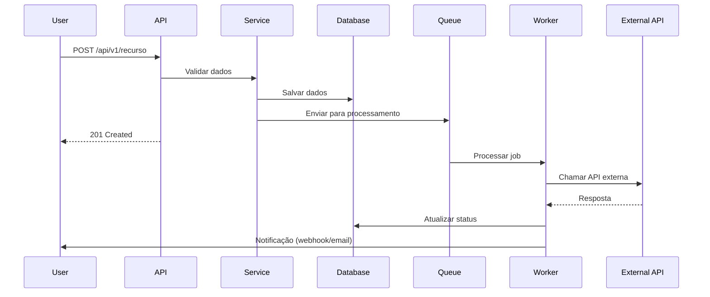
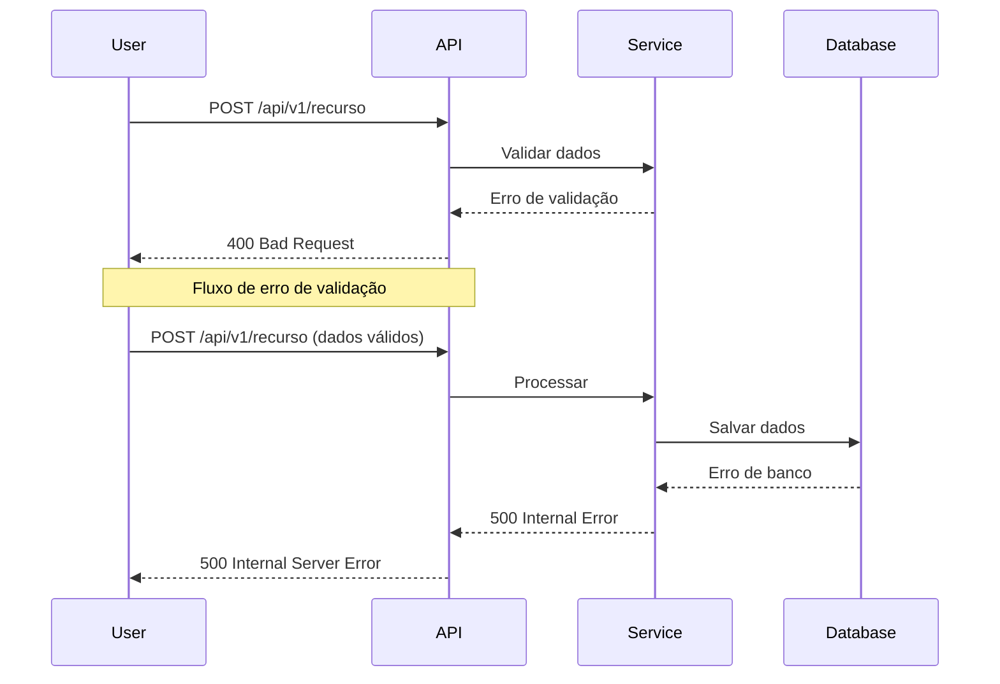
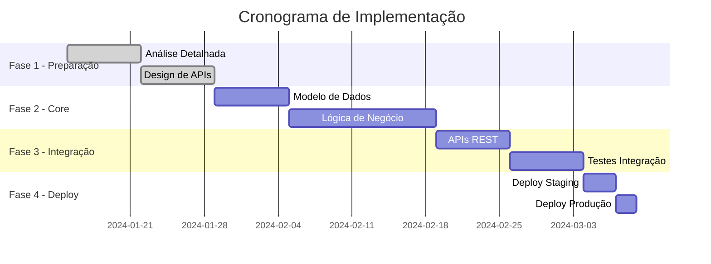
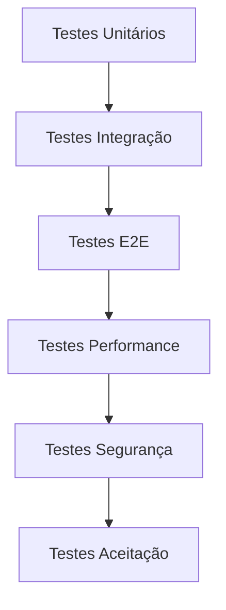

# Technical Specification - [Nome da Funcionalidade]

<div align="center">

**Versão**: [X.Y.Z] | **Status**: [Draft/Review/Approved] | **Última Atualização**: [DD/MM/AAAA]

[](link-spec)
[](link-complexity)
[](link-impact)

[📋 Epic](link-epic) • [🔗 ADR](link-adr) • [📊 Protótipo](link-prototype)

</div>

---

## 📋 Índice

- [Visão Geral](#-visão-geral)
- [Requisitos](#-requisitos)
- [Arquitetura da Solução](#-arquitetura-da-solução)
- [Design Técnico](#-design-técnico)
- [Impacto em Sistemas](#-impacto-em-sistemas)
- [Plano de Implementação](#-plano-de-implementação)
- [Testes e Validação](#-testes-e-validação)
- [Considerações de Segurança](#-considerações-de-segurança)
- [Performance e Escalabilidade](#-performance-e-escalabilidade)
- [Monitoramento](#-monitoramento)
- [Riscos e Mitigações](#-riscos-e-mitigações)
- [Anexos](#-anexos)

---

## 🎯 Visão Geral

### Informações Básicas

| Campo | Valor |
|-------|-------|
| **Funcionalidade** | [Nome da Funcionalidade] |
| **Epic/Feature** | [EPIC-XXX] - [Nome do Epic] |
| **Autor** | [Nome] - [email] |
| **Tech Lead** | [Nome] - [email] |
| **Data de Criação** | [DD/MM/AAAA] |
| **Estimativa** | [X] story points / [Y] semanas |
| **Prioridade** | [Alta/Média/Baixa] |

### Contexto e Motivação

**Problema a Resolver**:
[Descrição clara do problema ou necessidade que motivou esta funcionalidade]

**Objetivos**:
- **Objetivo Principal**: [Objetivo primário da funcionalidade]
- **Objetivos Secundários**:
  - [Objetivo secundário 1]
  - [Objetivo secundário 2]

**Valor de Negócio**:
[Descrição do valor que esta funcionalidade trará para o negócio e usuários]

### Escopo

#### ✅ Dentro do Escopo
- [Item 1 que será implementado]
- [Item 2 que será implementado]
- [Item 3 que será implementado]

#### ❌ Fora do Escopo
- [Item 1 que NÃO será implementado nesta versão]
- [Item 2 que NÃO será implementado nesta versão]

---

## 📋 Requisitos

### Requisitos Funcionais

| ID | Requisito | Prioridade | Critério de Aceitação |
|----|-----------|------------|----------------------|
| **RF-001** | [Descrição do requisito] | Must Have | [Como validar] |
| **RF-002** | [Descrição do requisito] | Should Have | [Como validar] |
| **RF-003** | [Descrição do requisito] | Could Have | [Como validar] |

### Requisitos Não Funcionais

| ID | Categoria | Requisito | Métrica | Prioridade |
|----|-----------|-----------|---------|------------|
| **RNF-001** | Performance | [Descrição] | [Métrica específica] | Must Have |
| **RNF-002** | Segurança | [Descrição] | [Métrica específica] | Must Have |
| **RNF-003** | Usabilidade | [Descrição] | [Métrica específica] | Should Have |
| **RNF-004** | Escalabilidade | [Descrição] | [Métrica específica] | Could Have |

### User Stories

#### US-001: [Título da User Story]
**Como** [tipo de usuário]  
**Eu quero** [objetivo]  
**Para que** [benefício]

**Critérios de Aceitação**:
- [ ] [Critério 1]
- [ ] [Critério 2]
- [ ] [Critério 3]

**Definição de Pronto**:
- [ ] Código implementado e revisado
- [ ] Testes unitários passando
- [ ] Documentação atualizada
- [ ] Aprovação do Product Owner

---

## 🏗️ Arquitetura da Solução

### Visão Geral da Arquitetura



### Componentes Principais

#### [Nome do Componente 1]
- **Responsabilidade**: [Descrição da responsabilidade]
- **Tecnologia**: [Tecnologia utilizada]
- **Localização**: [Módulo/pacote no código]
- **Dependências**: [Componentes dos quais depende]
- **Interfaces**: [APIs/contratos expostos]

#### [Nome do Componente 2]
- **Responsabilidade**: [Descrição da responsabilidade]
- **Tecnologia**: [Tecnologia utilizada]
- **Localização**: [Módulo/pacote no código]
- **Dependências**: [Componentes dos quais depende]
- **Interfaces**: [APIs/contratos expostos]

### Padrões Arquiteturais

- **[Padrão 1]**: [Justificativa para uso]
- **[Padrão 2]**: [Justificativa para uso]
- **[Padrão 3]**: [Justificativa para uso]

---

## 🔧 Design Técnico

### Modelo de Dados

#### Entidades Principais

```sql
-- Nova tabela para a funcionalidade
CREATE TABLE [nome_tabela] (
    id SERIAL PRIMARY KEY,
    [campo1] VARCHAR(255) NOT NULL,
    [campo2] INTEGER DEFAULT 0,
    [campo3] JSONB,
    [campo4] TIMESTAMP DEFAULT CURRENT_TIMESTAMP,
    created_at TIMESTAMP DEFAULT CURRENT_TIMESTAMP,
    updated_at TIMESTAMP DEFAULT CURRENT_TIMESTAMP
);

-- Índices necessários
CREATE INDEX idx_[tabela]_[campo] ON [nome_tabela]([campo]);
CREATE INDEX idx_[tabela]_created_at ON [nome_tabela](created_at);
```

#### Relacionamentos



### APIs e Interfaces

#### Novos Endpoints

```http
POST /api/v1/[recurso]
Content-Type: application/json
Authorization: Bearer {token}

{
  "[campo1]": "[valor1]",
  "[campo2]": "[valor2]",
  "configuracoes": {
    "[opcao1]": true,
    "[opcao2]": "valor"
  }
}
```

**Resposta (201 Created)**:
```json
{
  "success": true,
  "data": {
    "id": 123,
    "[campo1]": "[valor1]",
    "[campo2]": "[valor2]",
    "status": "ativo",
    "created_at": "2024-01-01T12:00:00Z"
  },
  "meta": {
    "version": "1.0",
    "timestamp": "2024-01-01T12:00:00Z"
  }
}
```

#### Modificações em Endpoints Existentes

| Endpoint | Modificação | Impacto | Backward Compatible |
|----------|-------------|---------|-------------------|
| `GET /api/v1/users` | Adicionar campo `[novo_campo]` | Baixo | ✅ Sim |
| `POST /api/v1/orders` | Novo parâmetro opcional | Médio | ✅ Sim |

### Fluxos de Dados

#### Fluxo Principal



#### Fluxos de Exceção



---

## 🔄 Impacto em Sistemas

### Sistemas Afetados

| Sistema | Tipo de Impacto | Descrição | Ação Necessária |
|---------|----------------|-----------|-----------------|
| **[Sistema 1]** | Modificação | [Descrição do impacto] | [Ação requerida] |
| **[Sistema 2]** | Integração | [Nova integração necessária] | [Implementação requerida] |
| **[Sistema 3]** | Dependência | [Sistema depende da nova funcionalidade] | [Coordenação necessária] |

### Análise de Dependências

#### Dependências Upstream (Sistemas que afetam esta funcionalidade)
- **[Sistema A]**: [Como afeta] - [Risco: Alto/Médio/Baixo]
- **[Sistema B]**: [Como afeta] - [Risco: Alto/Médio/Baixo]

#### Dependências Downstream (Sistemas afetados por esta funcionalidade)
- **[Sistema C]**: [Como será afetado] - [Ação necessária]
- **[Sistema D]**: [Como será afetado] - [Ação necessária]

### Compatibilidade

#### Backward Compatibility
- ✅ **APIs existentes**: Mantidas sem alterações
- ✅ **Banco de dados**: Migrations não destrutivas
- ⚠️ **Configurações**: Nova configuração opcional adicionada

#### Forward Compatibility
- **Versionamento de API**: Suporte a v1 e v2
- **Feature Flags**: Funcionalidade pode ser habilitada/desabilitada
- **Graceful Degradation**: Sistema funciona sem a nova funcionalidade

---

## 📋 Plano de Implementação

### Fases de Implementação



### Breakdown de Tarefas

#### Fase 1: Preparação (Semana 1-2)
- [ ] **TASK-001**: Análise detalhada de requisitos - [Responsável] - [2 dias]
- [ ] **TASK-002**: Design de APIs e contratos - [Responsável] - [3 dias]
- [ ] **TASK-003**: Definição do modelo de dados - [Responsável] - [2 dias]

#### Fase 2: Desenvolvimento Core (Semana 3-5)
- [ ] **TASK-004**: Implementar modelo de dados - [Responsável] - [3 dias]
- [ ] **TASK-005**: Desenvolver lógica de negócio - [Responsável] - [5 dias]
- [ ] **TASK-006**: Implementar validações - [Responsável] - [2 dias]

#### Fase 3: Integração (Semana 6-7)
- [ ] **TASK-007**: Desenvolver APIs REST - [Responsável] - [4 dias]
- [ ] **TASK-008**: Implementar testes de integração - [Responsável] - [3 dias]

#### Fase 4: Deploy (Semana 8)
- [ ] **TASK-009**: Deploy em staging - [Responsável] - [1 dia]
- [ ] **TASK-010**: Testes de aceitação - [Responsável] - [2 dias]
- [ ] **TASK-011**: Deploy em produção - [Responsável] - [1 dia]

### Critérios de Aceitação por Fase

| Fase | Critérios de Conclusão |
|------|------------------------|
| **Fase 1** | Design aprovado, APIs documentadas |
| **Fase 2** | Testes unitários passando, code review aprovado |
| **Fase 3** | Testes de integração passando, documentação atualizada |
| **Fase 4** | Sistema em produção, métricas normais |

---

## 🧪 Testes e Validação

### Estratégia de Testes



### Testes Unitários

#### Cobertura Esperada
- **Meta**: ≥ 90% cobertura para código novo
- **Foco**: Lógica de negócio, validações, transformações

#### Casos de Teste Principais
```python
class TestNovaFuncionalidade:
    def test_criar_recurso_sucesso(self):
        """Testa criação bem-sucedida de recurso."""
        # Arrange
        dados = {"campo1": "valor", "campo2": 123}
        
        # Act
        resultado = service.criar_recurso(dados)
        
        # Assert
        assert resultado.id is not None
        assert resultado.campo1 == "valor"
    
    def test_validacao_dados_invalidos(self):
        """Testa validação com dados inválidos."""
        # Arrange
        dados = {"campo1": "", "campo2": -1}
        
        # Act & Assert
        with pytest.raises(ValidationError):
            service.criar_recurso(dados)
```

### Testes de Integração

#### Cenários de Teste
- **Integração com banco de dados**
- **Integração com APIs externas**
- **Integração com sistema de filas**
- **Integração com cache**

### Testes de Performance

#### Métricas Alvo
| Métrica | Valor Alvo | Como Medir |
|---------|------------|------------|
| **Tempo de Resposta** | < 200ms | Testes de carga |
| **Throughput** | > 1000 req/s | Testes de stress |
| **Uso de Memória** | < 512MB | Profiling |
| **Uso de CPU** | < 70% | Monitoramento |

---

## 🔒 Considerações de Segurança

### Análise de Segurança

#### Superfície de Ataque
- **Novos endpoints**: [X] endpoints públicos
- **Dados sensíveis**: [Tipos de dados que serão processados]
- **Integrações externas**: [X] integrações com terceiros

#### Controles de Segurança

| Controle | Implementação | Status |
|----------|---------------|--------|
| **Autenticação** | JWT Bearer Token | ✅ Implementado |
| **Autorização** | RBAC baseado em roles | 📋 Planejado |
| **Validação de Entrada** | Pydantic schemas | ✅ Implementado |
| **Rate Limiting** | Redis + middleware | 📋 Planejado |
| **Audit Logging** | Structured logs | 📋 Planejado |

### Compliance

#### LGPD
- [ ] Dados pessoais identificados e catalogados
- [ ] Consentimento implementado quando necessário
- [ ] Direito ao esquecimento implementado
- [ ] Logs de auditoria para acesso a dados

#### OWASP Top 10
- [ ] **A01 - Broken Access Control**: Controles implementados
- [ ] **A02 - Cryptographic Failures**: Dados sensíveis criptografados
- [ ] **A03 - Injection**: Queries parametrizadas
- [ ] **A04 - Insecure Design**: Threat modeling realizado

---

## ⚡ Performance e Escalabilidade

### Análise de Performance

#### Gargalos Identificados
- **Consultas de banco**: [Descrição e solução]
- **Processamento de dados**: [Descrição e solução]
- **Integrações externas**: [Descrição e solução]

#### Otimizações Implementadas

```python
# Exemplo de otimização - Cache
@cache.memoize(timeout=300)
def get_dados_complexos(parametros):
    """Função com cache para dados complexos."""
    return processar_dados_pesados(parametros)

# Exemplo de otimização - Bulk operations
def processar_lote(items):
    """Processa itens em lote para melhor performance."""
    return bulk_insert(items, batch_size=1000)
```

### Estratégia de Escalabilidade

#### Escalabilidade Horizontal
- **Load Balancer**: Distribuição de carga entre instâncias
- **Database Sharding**: Particionamento de dados se necessário
- **Microserviços**: Separação de responsabilidades

#### Escalabilidade Vertical
- **Resource Limits**: Configuração adequada de CPU/memória
- **Connection Pooling**: Pool de conexões otimizado
- **Caching Strategy**: Cache em múltiplas camadas

---

## 📊 Monitoramento

### Métricas de Negócio

| Métrica | Descrição | Alerta |
|---------|-----------|--------|
| **Taxa de Sucesso** | % de operações bem-sucedidas | < 95% |
| **Tempo de Processamento** | Tempo médio de processamento | > 500ms |
| **Volume de Transações** | Número de transações/hora | Baseline ± 50% |

### Métricas Técnicas

```python
# Exemplo de métricas customizadas
from prometheus_client import Counter, Histogram, Gauge

# Contadores
requests_total = Counter('requests_total', 'Total requests', ['method', 'endpoint'])
errors_total = Counter('errors_total', 'Total errors', ['error_type'])

# Histogramas
request_duration = Histogram('request_duration_seconds', 'Request duration')
processing_time = Histogram('processing_time_seconds', 'Processing time')

# Gauges
active_connections = Gauge('active_connections', 'Active connections')
queue_size = Gauge('queue_size', 'Queue size')
```

### Alertas e Dashboards

#### Alertas Críticos
- **Sistema indisponível**: Response time > 5s por 2 minutos
- **Taxa de erro alta**: Error rate > 5% por 5 minutos
- **Fila saturada**: Queue size > 1000 itens

#### Dashboard Principal
- **Visão geral**: Métricas principais em tempo real
- **Performance**: Gráficos de latência e throughput
- **Erros**: Análise de erros por tipo e frequência
- **Recursos**: Uso de CPU, memória e rede

---

## ⚠️ Riscos e Mitigações

### Riscos Técnicos

| ID | Risco | Probabilidade | Impacto | Mitigação | Responsável |
|----|-------|---------------|---------|-----------|-------------|
| **RT-001** | Performance degradada | Média | Alto | Testes de carga, otimizações | Tech Lead |
| **RT-002** | Falha na integração externa | Alta | Médio | Circuit breaker, fallback | Dev Backend |
| **RT-003** | Problemas de escalabilidade | Baixa | Alto | Load testing, monitoring | DevOps |

### Riscos de Negócio

| ID | Risco | Probabilidade | Impacto | Mitigação | Responsável |
|----|-------|---------------|---------|-----------|-------------|
| **RN-001** | Baixa adoção pelos usuários | Média | Alto | UX research, feedback loops | Product Owner |
| **RN-002** | Mudança de requisitos | Alta | Médio | Prototipagem, validação contínua | Product Owner |

### Plano de Contingência

#### Rollback Strategy
- **Critérios**: Error rate > 10% ou response time > 2s
- **Processo**: Feature flag disable + database rollback se necessário
- **Tempo**: < 15 minutos para rollback completo

#### Disaster Recovery
- **Backup**: Backup automático antes do deploy
- **Recovery Time**: < 1 hora para restauração completa
- **Data Loss**: Máximo 5 minutos de dados

---

## 📎 Anexos

### Anexo A: Protótipos e Mockups

#### Wireframes
[Links para wireframes ou imagens dos protótipos]

#### Fluxos de Usuário
[Diagramas de fluxo de usuário]

### Anexo B: Benchmarks e Análises

#### Análise de Performance
```bash
# Resultados de benchmark
wrk -t12 -c400 -d30s --latency http://api.exemplo.com/v1/recurso

Running 30s test @ http://api.exemplo.com/v1/recurso
  12 threads and 400 connections
  Thread Stats   Avg      Stdev     Max   +/- Stdev
    Latency   145.32ms   89.45ms   1.20s    78.23%
    Req/Sec   234.56     45.78   456.78    89.12%
  84567 requests in 30.10s, 12.34MB read
Requests/sec: 2810.23
Transfer/sec: 419.87KB
```

### Anexo C: Configurações

#### Configurações de Ambiente
```yaml
# config/production.yml
database:
  pool_size: 20
  timeout: 30
  
cache:
  ttl: 300
  max_connections: 100
  
api:
  rate_limit: 1000
  timeout: 30
```

### Anexo D: Scripts de Migração

```sql
-- Migration: 001_add_nova_funcionalidade.sql
BEGIN;

CREATE TABLE nova_funcionalidade (
    id SERIAL PRIMARY KEY,
    nome VARCHAR(255) NOT NULL,
    dados JSONB,
    created_at TIMESTAMP DEFAULT CURRENT_TIMESTAMP
);

CREATE INDEX idx_nova_funcionalidade_nome ON nova_funcionalidade(nome);

COMMIT;
```

---

<div align="center">

**Preparado por**: [Nome do Autor] - [Data]  
**Revisado por**: [Nome do Tech Lead] - [Data]  
**Aprovado por**: [Nome do Arquiteto] - [Data]

---

**Para dúvidas técnicas**: [email-tech] | **Documentação completa**: [link-docs]

</div>