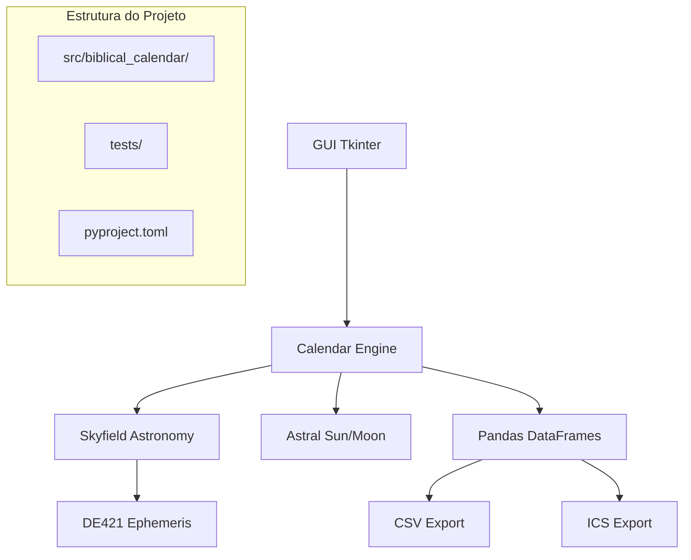

# Biblical Calendar App

<div align="center">


**Calendário bíblico-lunissolar dinâmico com cálculos astronômicos precisos**

[](https://python.org)
[](LICENSE)
[](https://github.com/vanderloto/biblical_calendar_app)
[](https://python-poetry.org)
[](tests/)

[🚀 Instalação](#-instalação) • [📖 Uso](#-uso) • [🔧 Funcionalidades](#-funcionalidades) • [📊 Screenshots](#-screenshots)

</div>

---

## 📋 Índice

- [Sobre o Projeto](#-sobre-o-projeto)
- [Funcionalidades](#-funcionalidades)
- [Tecnologias](#-tecnologias)
- [Pré-requisitos](#-pré-requisitos)
- [Instalação](#-instalação)
- [Uso](#-uso)
- [Configuração](#-configuração)
- [Contribuição](#-contribuição)
- [Licença](#-licença)
- [Contato](#-contato)

---

## 🎯 Sobre o Projeto

### Visão Geral

O Biblical Calendar App é um calendário bíblico-lunissolar dinâmico que calcula com precisão astronômica o início de cada mês baseado nas luas novas observáveis em Jerusalém. O sistema ajusta automaticamente a duração dos meses conforme as fases lunares e inclui informações completas sobre festas bíblicas, feriados e estações astronômicas.

### Objetivos

- **Precisão Astronômica**: Cálculos baseados em efemérides astronômicas (DE421)
- **Flexibilidade**: Suporte a heurística de visibilidade da primeira crescente
- **Completude**: Inclui festivais bíblicos e eventos relacionados a Yeshua
- **Usabilidade**: Interface gráfica intuitiva com múltiplas visualizações
- **Exportação**: Suporte a formatos padrão (CSV, ICS)

### Benefícios

- ✅ **Cálculos Precisos**: Baseado em algoritmos astronômicos profissionais
- ✅ **Flexível**: Opção entre lua nova astronômica ou primeira crescente visível
- ✅ **Completo**: Inclui todas as festas bíblicas e eventos de Yeshua
- ✅ **Visual**: Calendário visual com navegação mensal
- ✅ **Exportável**: Integração com outros calendários via ICS

---

## ⚡ Funcionalidades

### Principais

- 🌙 **Cálculo Lunar Dinâmico**: Meses baseados em luas novas astronômicas
- 🔭 **Heurística de Visibilidade**: Primeira crescente visível em Jerusalém
- 📅 **Detecção Automática**: Anos embolísmicos (13 meses) com Adar I/II
- 🎉 **Festivais Bíblicos Completos**: 10 festivais incluindo Pessach, Chag HaMatzot, Omer Reshit, Shavuot, Rosh Hashaná, Yom Kippur, Sukkot, Chanucá, Purim
- ✝️ **Eventos de Yeshua**: Nascimento (2 hipóteses) e crucificação
- 🌍 **Estações Astronômicas**: Equinócios e solstícios para Jerusalém/São Paulo
- 🌕 **Fases Lunares Completas**: Nova, Crescente, Cheia, Minguante
- ☀️ **Nascer/Pôr do Sol**: Cálculos precisos para múltiplas localidades
- 🚀 **Seleção Automática de Efemérides**: DE421 (1900-2050) ou DE440 (>2050)
- 🔬 **Modo Pesquisa Acadêmica**: Força DE440 para máxima precisão científica

### Interface e Navegação

- **Calendário Visual Interativo**: Navegação mensal com clique em dias (1400x900px)
- **Navegação Contínua**: Botões Anterior/Próximo com transição automática de anos
- **Botão "Hoje"**: Navegação rápida para o mês atual
- **Painel de Eventos Expandido**: Área ampliada (450px) com descrições completas
- **Nomes Bilíngues**: Hebraico e português para festivais
- **Descrições Educativas**: Contexto histórico e religioso para todos os eventos
- **Estação Atual**: Mostra estação astronômica para ambas localidades
- **Interface Responsiva**: Layout otimizado para melhor experiência visual

### Funcionalidades Avançadas

- **Exportação CSV**: Dados tabulares para análise com metadados de precisão
- **Exportação ICS**: Integração com Google Calendar, Outlook, etc.
- **Interface Multilíngue**: Suporte completo a português
- **Configuração Flexível**: Escolha entre métodos de cálculo
- **Legenda Visual**: Símbolos para fases lunares, festivais e estações
- **Gestão Inteligente**: Seleção automática da melhor efeméride por ano
- **Modo Acadêmico**: Precisão máxima para pesquisas científicas
- **Cronologias Comparativas**: Ussher (Criação), Hebraico (AM) e Gregoriano (DC)

---

## 🛠️ Tecnologias

### Stack Principal

| Categoria | Tecnologia | Versão | Descrição |
|-----------|------------|--------|-----------|
| **Runtime** | Python | 3.11+ | Linguagem principal |
| **Astronomia** | Skyfield | 1.45+ | Cálculos astronômicos |
| **Efemérides** | DE421/DE440 | NASA/JPL | Dados planetários precisos |
| **Interface** | Tkinter | Built-in | GUI nativa |
| **Dados** | Pandas | 2.3+ | Manipulação de dados |
| **Calendário** | iCalendar | 6.3+ | Exportação ICS |

### Dependências Principais

```toml
[tool.poetry.dependencies]
python = "^3.11"
skyfield = "^1.45"
pandas = "^2.3.2"
icalendar = "^6.3.1"
astral = "^3.2"
pytz = "^2025.1"
```

### Arquitetura



---

## 📋 Pré-requisitos

### Requisitos do Sistema

- **Sistema Operacional**: Windows 10+, macOS 10.15+, Linux Ubuntu 20.04+
- **Memória RAM**: 512 MB mínimo, 1 GB recomendado
- **Espaço em Disco**: 200 MB disponível
- **Resolução de Tela**: 1440x960 mínimo (recomendado para interface expandida)
- **Rede**: Conexão com internet para download de efemérides

### Software Necessário

- **Python**: 3.11 ou superior - [Download](https://python.org/downloads/)
- **Poetry**: Para gerenciamento de dependências - [Instalação](https://python-poetry.org/docs/#installation)

### Verificação de Pré-requisitos

```bash
# Verificar versão do Python
python --version

# Verificar Poetry
poetry --version
```

---

## 🚀 Instalação

### Instalação Rápida

```bash
# Clone o repositório
git clone https://github.com/vanderloto/biblical_calendar_app.git
cd biblical_calendar_app

# Instale as dependências
poetry install

# Execute a aplicação
poetry run biblical-calendar
```

### Instalação Detalhada

<details>
<summary>Clique para ver instruções detalhadas</summary>

#### 1. Clone o Repositório

```bash
git clone https://github.com/vanderloto/biblical_calendar_app.git
cd biblical_calendar_app
```

#### 2. Configure o Ambiente

```bash
# Instale Poetry se não tiver
curl -sSL https://install.python-poetry.org | python3 -

# Configure Poetry para criar venv no projeto
poetry config virtualenvs.in-project true
```

#### 3. Instale as Dependências

```bash
# Instale dependências do projeto
poetry install

# Ative o ambiente virtual
poetry shell
```

#### 4. Download de Efemérides

O arquivo `de421.bsp` será baixado automaticamente na primeira execução.

</details>

### Verificação da Instalação

```bash
# Teste se a aplicação inicia
poetry run biblical-calendar

# Ou teste a importação
poetry run python -c "from biblical_calendar import BiblicalCalendarApp; print('OK')"
```

---

## 💻 Uso

### Início Rápido

1. **Execute a aplicação**:
   ```bash
   poetry run biblical-calendar
   ```

2. **Configure o ano**: Insira o ano desejado no campo "Ano referência"

3. **Escolha as opções**:
   - Marque "Heurística visibilidade" para primeira crescente visível
   - Marque "🔬 Modo Pesquisa Acadêmica" para máxima precisão (DE440)

4. **Gere o calendário**: Clique em "Gerar"

5. **Explore as abas**: Navegue entre Calendário Visual, Meses, Festas e Estações

6. **Verifique a efeméride**: Status mostrado no canto inferior direito

### Interface do Usuário

#### Aba Meses
- Lista tabular com todos os meses do ano
- Colunas: Índice, Nome, Data Início, Data Fim, Dias
- Identificação automática de anos embolísmicos

#### Aba Festas & Yeshua
- Lista completa de festivais bíblicos
- Eventos relacionados a Yeshua (nascimento e crucificação)
- Datas calculadas automaticamente

#### Aba Estações
- Equinócios e solstícios para Jerusalém e São Paulo
- Horários de nascer/pôr do sol para Nissan 1
- Todos os horários em UTC

#### Aba Calendário Visual (Principal)
- Visualização mensal estilo calendário com datas gregorianas
- Navegação contínua com botões Anterior/Próximo/Hoje
- Transição automática entre anos (1-2100)
- Anotações visuais: festivais (★), fases lunares (🌑🌓🌕🌗), estações (🌍)
- Painel "Eventos do Dia" expandido (450px x 20 linhas) com descrições completas
- Interface ampliada (1400x900px) para melhor visualização
- Descrições detalhadas dos eventos de Yeshua com contexto teológico
- Nomes hebraicos e traduções portuguesas
- Indicação da estação astronômica atual para ambas localidades
- Destaque visual para o dia atual (fundo azul)

### Exportação

#### CSV (Meses)
```bash
# Clique em "Exportar CSV (meses)"
# Arquivo contém: index,name,start,end,days
```

#### ICS (Festivais)
```bash
# Clique em "Exportar ICS (festas)"
# Arquivo compatível com Google Calendar, Outlook, etc.
```

---

## ⚙️ Configuração

### Métodos de Cálculo

#### Lua Nova Astronômica (Padrão)
- Baseado no momento exato da conjunção Sol-Lua
- Precisão astronômica máxima
- Recomendado para estudos acadêmicos

#### Primeira Crescente Visível (Heurística)
- Simula observação visual em Jerusalém
- Considera elongação ≥ 10° e altitude ≥ 3°
- Mais próximo da prática histórica

#### Seleção Automática de Efemérides
- **DE421**: Anos 1900-2050 (17 MB, precisão padrão)
- **DE440**: Anos >2050 ou modo acadêmico (128 MB, máxima precisão)
- **Fallback**: DE430 se DE440 indisponível

#### Modo Pesquisa Acadêmica
- Força uso de DE440 independente do ano
- Máxima precisão astronômica disponível
- Metadados de precisão nos exports
- Recomendado para publicações científicas

### Localidades e Efemérides

#### Localidades Suportadas
```python
# Jerusalém (padrão)
JERUSALEM = {
    "name": "Jerusalem", 
    "lat": 31.7683, 
    "lon": 35.2137, 
    "tz": "Asia/Jerusalem"
}

# São Paulo (comparação)
SAOPAULO = {
    "name": "São Paulo", 
    "lat": -23.5505, 
    "lon": -46.6333, 
    "tz": "America/Sao_Paulo"
}
```

#### Gestão de Efemérides
```python
# Seleção automática baseada no ano
def load_optimal_ephemeris(year: int, force_academic: bool = False):
    if force_academic:
        return api.load('de440.bsp')  # Máxima precisão
    elif year <= 2050:
        return api.load('de421.bsp')  # Padrão 1900-2050
    else:
        return api.load('de440.bsp')  # Necessário >2050
```

### Festivais Configurados

#### Festivais Bíblicos (10 festivais)
```python
FESTIVALS_DEF = {
    # Festas da Primavera
    "Pessach": (1, 15),                    # Páscoa - Nissan 15
    "Chag HaMatzot": (1, 16),             # Festa dos Pães Asmos - Nissan 16
    "Omer Reshit": (1, 17),               # Primícias - Nissan 17
    
    # Festa do Verão
    "Shavuot": (3, 6),                    # Pentecostes - Sivan 6
    
    # Festas do Outono
    "Rosh Hashaná": (7, 1),               # Festa das Trombetas - Tishrei 1
    "Yom Kippur": (7, 10),                # Dia da Expiação - Tishrei 10
    "Sukkot": (7, 15),                    # Festa dos Tabernáculos - Tishrei 15
    
    # Outras celebrações
    "Chanucá": (9, 25),                   # Festa das Luzes - Kislev 25
    "Purim": (12, 14),                    # Festa de Purim - Adar 14
}
```

#### Eventos de Yeshua
```python
YESHUA_EVENTS_DEF = {
    "Nascimento de Yeshua (hipótese Nissan)": (1, 15),
    "Nascimento de Yeshua (hipótese Tishrei/Sukkot)": (7, 15),
    "Morte de Yeshua (Crucificação - Pessach)": (1, 14)
}
```

#### Traduções e Descrições
- **Nomes Bilíngues**: Hebraico original + tradução portuguesa
- **Descrições Educativas**: Contexto histórico e religioso para cada festival
- **Fases Lunares**: Descrições astronômicas para Nova, Crescente, Cheia, Minguante
- **Estações**: Informações para ambos hemisférios (Jerusalém/São Paulo)

---

## 📚 Documentação

A documentação completa está organizada na pasta `docs/`:

- **[Guia do Produto](docs/user-guide/product-guide.md)**: Guia completo para usuários finais
- **[Guia de Instalação](docs/user-guide/installation-guide.md)**: Instruções detalhadas de instalação
- **[Manual do Usuário](docs/user-guide/user-manual.md)**: Como usar a aplicação
- **[Guia de Cronologias](docs/user-guide/chronologies-guide.md)**: Sistemas cronológicos comparativos
- **[Arquitetura](docs/technical/architecture.md)**: Documentação técnica do sistema
- **[Gerenciamento de Efemérides](docs/technical/ephemeris-management.md)**: Guia técnico sobre DE421/DE440
- **[Arquitetura Web](docs/technical/web-architecture.md)**: Especificação da versão web
- **[API Reference](docs/api/api-reference.md)**: Referência das funções e classes
- **[Product Backlog](docs/product-backlog.md)**: Roadmap e funcionalidades futuras
- **[Changelog](docs/changelog.md)**: Histórico de mudanças

---

## 📁 Estrutura do Projeto

```
biblical_calendar_app/
├── src/
│   └── biblical_calendar/
│       ├── __init__.py          # Módulo principal
│       └── calendar.py          # Lógica do calendário
├── tests/
│   ├── __init__.py
│   └── test_calendar.py         # Testes unitários
├── .amazonq/
│   └── rules/                   # Regras DATAMETRIA
├── pyproject.toml               # Configuração Poetry
├── README.md                    # Documentação principal
├── CHANGELOG.md                 # Histórico de mudanças
└── LICENSE                      # Licença MIT
```

### Padrões Seguidos

- **📁 Src Layout**: Código fonte em `src/` seguindo padrões Python
- **📝 Poetry**: Gerenciamento de dependências e build
- **🧪 Google Style**: Docstrings e documentação padronizada
- **⚙️ DATAMETRIA**: Regras e templates organizacionais
- **🧩 Pytest**: Estrutura de testes unitários

---

## 🧪 Testes

### Executar Testes

```bash
# Todos os testes
poetry run pytest

# Testes com cobertura
poetry run pytest --cov=src --cov-report=html

# Testes específicos
poetry run pytest tests/test_calendar.py -v
```

### Estrutura de Testes

- **Testes Unitários**: Validação de funções principais
- **Testes de Edge Cases**: Anos extremos e casos especiais
- **Testes de Consistência**: Validação de datas e cálculos
- **Cobertura**: 80%+ das funcionalidades principais

### Qualidade de Código

```bash
# Formatação
poetry run black src/ tests/

# Linting
poetry run flake8 src/ tests/

# Type checking
poetry run mypy src/

# Segurança
poetry run bandit -r src/
```

---

## 🤝 Contribuição

Contribuições são sempre bem-vindas! Veja como você pode ajudar:

### Como Contribuir

1. **Fork** o projeto
2. **Crie** uma branch para sua feature (`git checkout -b feature/NovaFuncionalidade`)
3. **Commit** suas mudanças (`git commit -m 'Adiciona nova funcionalidade'`)
4. **Push** para a branch (`git push origin feature/NovaFuncionalidade`)
5. **Abra** um Pull Request

### Diretrizes

- Siga os padrões de código do projeto (Google Style)
- Escreva testes para novas funcionalidades
- Atualize a documentação quando necessário
- Use type hints em todas as funções

### Tipos de Contribuição

- 🐛 **Bug Reports**: Reporte bugs usando GitHub Issues
- 💡 **Feature Requests**: Sugira novas funcionalidades
- 📖 **Documentação**: Melhore a documentação
- 🧪 **Testes**: Adicione ou melhore testes
- 🌍 **Localização**: Adicione suporte a outros idiomas

---

## 📄 Licença

Este projeto está licenciado sob a Licença MIT - veja o arquivo [LICENSE](LICENSE) para detalhes.

### Resumo da Licença

- ✅ **Uso Comercial**: Permitido
- ✅ **Modificação**: Permitida
- ✅ **Distribuição**: Permitida
- ✅ **Uso Privado**: Permitido
- ❌ **Responsabilidade**: Não assumida
- ❌ **Garantia**: Não fornecida

---

## 📞 Contato

### Desenvolvedor

- **Nome**: Vander Loto
- **Email**: vander.loto@outlook.com
- **Empresa**: DATAMETRIA
- **LinkedIn**: [Vander Loto](https://linkedin.com/in/vanderloto)

### Suporte

- 📧 **Email**: vander.loto@outlook.com
- 🐛 **Issues**: [GitHub Issues](https://github.com/vanderloto/biblical_calendar_app/issues)
- 💬 **Discussões**: [GitHub Discussions](https://github.com/vanderloto/biblical_calendar_app/discussions)

---

## 🙏 Agradecimentos

### Tecnologias e Bibliotecas

Agradecemos às comunidades open source das tecnologias utilizadas:

- **[Skyfield](https://rhodesmill.org/skyfield/)** - Cálculos astronômicos precisos
- **[Astral](https://astral.readthedocs.io/)** - Cálculos solares e lunares
- **[Pandas](https://pandas.pydata.org/)** - Manipulação de dados
- **[iCalendar](https://icalendar.readthedocs.io/)** - Padrão de calendário
- **[Python](https://python.org/)** - Linguagem de programação

### Inspirações

- **Calendário Hebraico Tradicional**: Base histórica e religiosa
- **Astronomia Moderna**: Precisão científica
- **Comunidade Open Source**: Espírito colaborativo

---

<div align="center">

**Feito com ❤️ por Vander Loto - DATAMETRIA**

⭐ **Se este projeto te ajudou, considere dar uma estrela!** ⭐

</div>