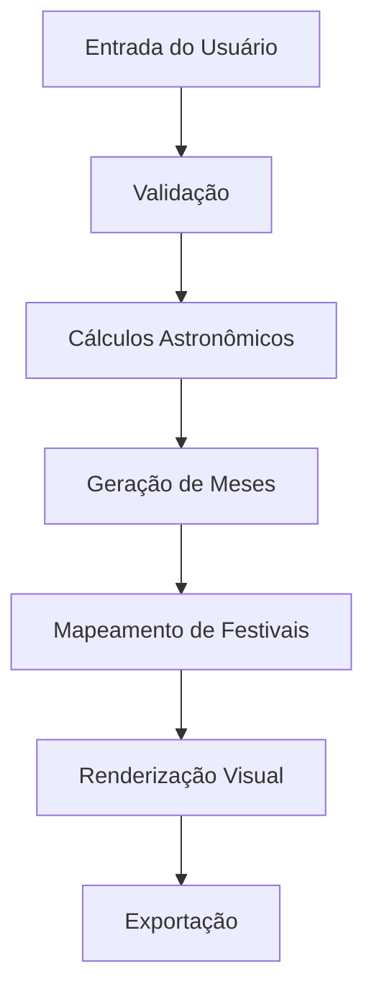

# Arquitetura - Biblical Calendar App

## Visão Geral

O Biblical Calendar App segue uma arquitetura modular baseada em Python com interface Tkinter e cálculos astronômicos precisos.

## Componentes Principais

### 1. Interface Gráfica (GUI)
- **Tecnologia**: Tkinter (nativo Python)
- **Responsabilidade**: Apresentação e interação do usuário
- **Localização**: `src/biblical_calendar/calendar.py` - classe `BiblicalCalendarApp`

### 2. Motor de Cálculos (Calendar Engine)
- **Tecnologia**: Skyfield + Astral
- **Responsabilidade**: Cálculos astronômicos e geração de meses
- **Localização**: `src/biblical_calendar/calendar.py` - funções principais

### 3. Exportação de Dados
- **Tecnologia**: Pandas + iCalendar
- **Responsabilidade**: Exportação CSV e ICS
- **Localização**: Funções de exportação integradas

## Fluxo de Dados

## Dependências Externas

- **Skyfield**: Cálculos astronômicos precisos
- **Astral**: Cálculos solares e lunares
- **Pandas**: Manipulação de dados
- **iCalendar**: Exportação de calendários
- **Pytz**: Gerenciamento de timezones